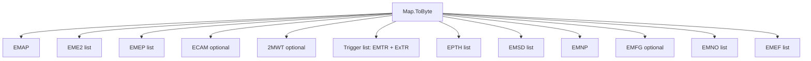
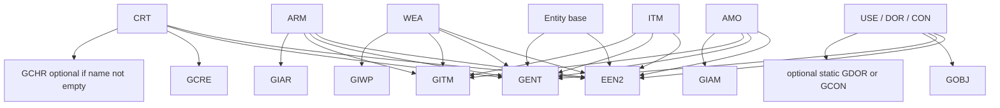
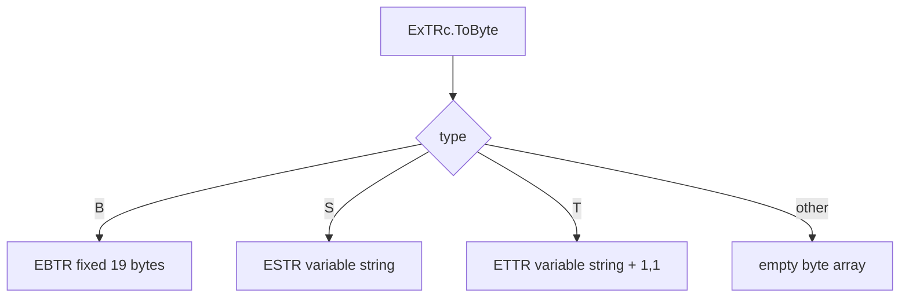
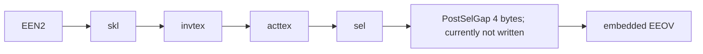
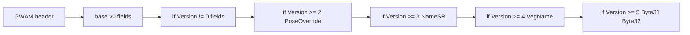
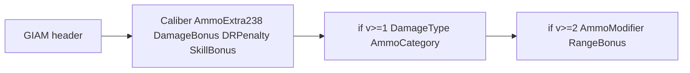
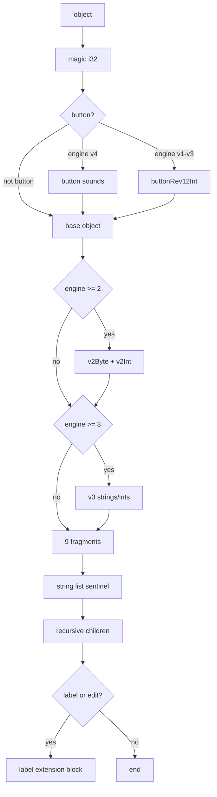
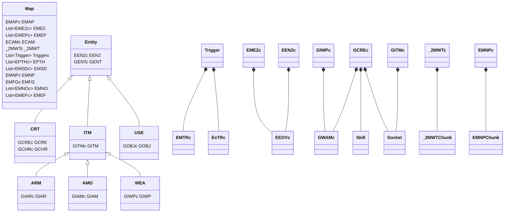

# Van Buren Filetype Classes — Memory Table / Map Diagrams

This document translates the provided C# `ToByte()` / reader logic into binary layout diagrams. Offsets are byte offsets from the start of the chunk/record unless otherwise stated.

## Legend

| Notation         | Meaning                                                                                                                                |
| ---------------- | -------------------------------------------------------------------------------------------------------------------------------------- |
| `Tag`            | 4 ASCII bytes such as `EMAP`, `GENT`, `GIWP`                                                                                           |
| `Ver`            | 32-bit version field at offset `+4`, when present                                                                                      |
| `Size`           | 32-bit chunk size at offset `+8`, when present                                                                                         |
| `u8`             | 1 byte                                                                                                                                 |
| `u16`            | 2 bytes, little-endian                                                                                                                 |
| `i32`            | 4 bytes, little-endian signed integer                                                                                                  |
| `f32`            | 4 bytes, little-endian IEEE float                                                                                                      |
| `bool`           | 1 byte as written by existing `Write(bool)` helper                                                                                     |
| `strLen + str`   | 16-bit or 32-bit length followed by ASCII chars, depending on the class                                                                |
| `Vector2`        | 8 bytes: `f32 X`, `f32 Y`                                                                                                              |
| `Vector3`        | 12 bytes: `f32 X`, `f32 Y`, `f32 Z`                                                                                                    |
| `Vector4`        | Treated as 24 bytes in these serializers because offsets advance by 24 in `EPTH`, and several chunks reserve `+24` after vector writes |
| `Color.ToByte()` | Existing project-specific color encoding; used as written                                                                              |
| `gap / unknown`  | bytes allocated or skipped but not explicitly written by the current serializer                                                        |

---

# 1. File / Object Composition Diagrams

## `Map` file composition order



Serialized order:

| Order | Field      | Chunk(s)                                          |
| ----: | ---------- | ------------------------------------------------- |
|     1 | `EMAP`     | `EMAP`                                            |
|     2 | `EME2`     | repeated `EME2` records, each embedding an `EEOV` |
|     3 | `EMEP`     | repeated `EMEP`                                   |
|     4 | `ECAM`     | optional `ECAM`                                   |
|     5 | `_2MWT`    | optional `2MWT` if water chunks exist             |
|     6 | `Triggers` | repeated `EMTR` + `EBTR` / `ESTR` / `ETTR`        |
|     7 | `EPTH`     | repeated `EPTH`                                   |
|     8 | `EMSD`     | repeated `EMSD`                                   |
|     9 | `EMNP`     | `EMNP` nav/path chunk container                   |
|    10 | `EMFG`     | optional fog chunk                                |
|    11 | `EMNO`     | repeated `EMNO` notes/markers                     |
|    12 | `EMEF`     | repeated `EMEF` effects                           |

## Entity file composition order



| Class | Serialized chunks                                        |
| ----- | -------------------------------------------------------- |
| `CRT` | `EEN2`, `GENT`, `GCRE`, optional `GCHR`                  |
| `ITM` | `EEN2`, `GENT`, `GITM`                                   |
| `ARM` | `EEN2`, `GENT`, `GITM`, `GIAR`                           |
| `AMO` | `EEN2`, `GENT`, `GITM`, `GIAM`                           |
| `WEA` | `EEN2`, `GENT`, `GITM`, `GIWP`                           |
| `USE` | `EEN2`, `GENT`, `GOBJ`, optional static `GDOR` or `GCON` |

---

# 2. Shared Mini-Records

## `Skill` record

Total: `8` bytes.

| Offset | Size | Field   | Type  |
| -----: | ---: | ------- | ----- |
|   `+0` |    4 | `Index` | `i32` |
|   `+4` |    4 | `Value` | `i32` |

## `Socket` record

Total allocated by code: `4 + ModelLen + TexLen` bytes, returned array size is `3 + ModelLen + TexLen + 1`.

|        Offset |       Size | Field      | Type / Value |
| ------------: | ---------: | ---------- | ------------ |
|          `+0` |          2 | `ModelLen` | `u16`        |
|          `+2` | `ModelLen` | `Model`    | ASCII        |
| `+2+ModelLen` |          2 | `TexLen`   | `u16`        |
| `+4+ModelLen` |   `TexLen` | `Tex`      | ASCII        |

## `_2MWTChunk` record

Total: `22 + texLen` bytes.

|       Offset |     Size | Field        | Type      |
| -----------: | -------: | ------------ | --------- |
|         `+0` |       12 | `loc`        | `Vector3` |
|        `+12` |        2 | `tex.Length` | `u16`     |
|        `+14` | `texLen` | `tex`        | ASCII     |
| `+14+texLen` |        8 | `texloc`     | `Vector2` |

## `EMNPChunk` record

Total: `30` bytes.

|     Offset | Size | Field                | Type      |
| ---------: | ---: | -------------------- | --------- |
|       `+0` |    1 | `bool`               | `u8`      |
|       `+1` |   12 | `l`                  | `Vector3` |
| `+13..+24` |   12 | unknown / unused gap | bytes     |
|      `+25` |    1 | `b1`                 | `u8`      |
|      `+26` |    1 | `b2`                 | `u8`      |
|      `+27` |    1 | `b3`                 | `u8`      |
|      `+28` |    1 | `b4`                 | `u8`      |
|      `+29` |    1 | `b5`                 | `u8`      |

---

# 3. Map Header / Chunk Classes

## `EMAPc` — `EMAP`

Total: `49 + s1Len + s2Len + s3Len` bytes.


|                       Offset |    Size | Field                       | Type / Value                                 |
| ---------------------------: | ------: | --------------------------- | -------------------------------------------- |
|                         `+0` |       4 | tag                         | `"EMAP"`                                     |
|                         `+4` |       4 | flag/version                | `0` if `il`, else `5`                        |
|                         `+8` |       4 | size                        | `49+s1Len+s2Len+s3Len`                       |
|                   `+12..+15` |       4 | unknown                     | zero unless `Write` helper fills elsewhere   |
|                        `+16` |       2 | `s1Len`                     | `u16`                                        |
|                        `+18` | `s1Len` | `s1`                        | ASCII                                        |
|                  `+18+s1Len` |       2 | `s2Len`                     | `u16`                                        |
|                  `+20+s1Len` | `s2Len` | `s2`                        | ASCII                                        |
|            `+20+s1Len+s2Len` |       2 | `s3Len`                     | `u16`                                        |
|            `+22+s1Len+s2Len` | `s3Len` | `s3`                        | ASCII                                        |
|      `+22+s1Len+s2Len+s3Len` |       2 | `le`                        | appears written as 2 bytes by offset spacing |
|      `+24+s1Len+s2Len+s3Len` |       8 | `col`                       | `Color.ToByte()` area as used by helper      |
|      `+32+s1Len+s2Len+s3Len` |       4 | constant                    | `1`                                          |
| `+36+s1Len+s2Len+s3Len..end` |      13 | unknown / trailing reserved | bytes                                        |

## `EME2c` — `EME2` with embedded `EEOV`

Total allocated: `39 + nameLen + EEOVSize` bytes.


|        Offset |       Size | Field         | Type / Value          |
| ------------: | ---------: | ------------- | --------------------- |
|          `+0` |          4 | tag           | `"EME2"`              |
|      `+4..+7` |          4 | version/flags | zero                  |
|          `+8` |          4 | size          | `39+nameLen+EEOVSize` |
|         `+12` |          2 | `nameLen`     | `u16`                 |
|         `+14` |  `nameLen` | `name`        | ASCII                 |
| `+14+nameLen` |         24 | `l`           | `Vector4` area        |
| `+38+nameLen` |          1 | constant      | `1`                   |
| `+39+nameLen` | `EEOVSize` | `EEOV`        | embedded chunk        |

Note: `PostLGap` is captured in the model but is not currently written by this serializer; the serializer writes `1` at `38+nameLen` then immediately writes `EEOV` at `39+nameLen`.

## `EEOVc` — `EEOV`

Total: `47 + s1Len+s2Len+s3Len+s4Len+s5Len + invBytes + a`, where `a = 2` if `ps4 == 2`, else `0`.


|                           Offset |     Size | Field             | Type / Value                         |
| -------------------------------: | -------: | ----------------- | ------------------------------------ |
|                             `+0` |        4 | tag               | `"EEOV"`                             |
|                             `+4` |        4 | inventory flag    | `2` if `inv.Any()`, else zero        |
|                             `+8` |        4 | size              | `47 + strings + invBytes + a`        |
|                            `+12` |        2 | `s1Len`           | `u16`                                |
|                            `+14` |  `s1Len` | `s1`              | ASCII                                |
|           `+14+s1Len..+24+s1Len` |       11 | unknown fixed gap | bytes                                |
|                      `+25+s1Len` |        2 | `s2Len`           | `u16`                                |
|                      `+27+s1Len` |  `s2Len` | `s2`              | ASCII                                |
|                `+27+s1Len+s2Len` |        2 | `s3Len`           | `u16`                                |
|                `+29+s1Len+s2Len` |  `s3Len` | `s3`              | ASCII                                |
| `+29+s1Len+s2Len+s3Len..+37+...` |        9 | unknown fixed gap | bytes                                |
|                   `+38+s1+s2+s3` |        2 | `s4Len`           | `u16`                                |
|                   `+40+s1+s2+s3` |  `s4Len` | `s4`              | ASCII                                |
|                `+40+s1+s2+s3+s4` |        1 | `ps4`             | appears byte-sized by offset spacing |
|                `+41+s1+s2+s3+s4` |      `a` | optional gap      | present when `ps4 == 2`              |
|              `+41+s1+s2+s3+s4+a` |        2 | `s5Len`           | `u16`                                |
|              `+43+s1+s2+s3+s4+a` |  `s5Len` | `s5`              | ASCII                                |
|           `+43+s1+s2+s3+s4+s5+a` |        4 | `inv.Length`      | `i32`                                |
|           `+47+s1+s2+s3+s4+s5+a` | variable | inventory entries | repeated `u16 len + ASCII`           |

## `EMEPc` — `EMEP`

Total: `109` bytes.

|      Offset | Size | Field         | Type / Value |
| ----------: | ---: | ------------- | ------------ |
|        `+0` |    4 | tag           | `"EMEP"`     |
|    `+4..+7` |    4 | version/flags | zero         |
|        `+8` |    4 | size          | `109`        |
|       `+12` |    4 | `index`       | `i32`        |
|  `+16..+72` |   57 | unknown gap   | bytes        |
|       `+73` |   12 | `p`           | `Vector3`    |
| `+85..+104` |   20 | unknown gap   | bytes        |
|      `+105` |    4 | `r`           | `f32`        |

## `ECAMc` — `ECAM`

Total: `28` bytes.

|   Offset |          Size | Field         | Type / Value                                                  |
| -------: | ------------: | ------------- | ------------------------------------------------------------- |
|     `+0` |             4 | tag           | `"ECAM"`                                                      |
| `+4..+7` |             4 | version/flags | zero                                                          |
|     `+8` |             4 | size          | `28`                                                          |
|    `+12` | 16 or 24 area | `p`           | `Vector4`; total chunk implies 16 bytes available after `+12` |

## `EMEFc` — `EMEF`

Total: `42 + s1Len + s2Len` bytes.

|            Offset |    Size | Field         | Type / Value     |
| ----------------: | ------: | ------------- | ---------------- |
|              `+0` |       4 | tag           | `"EMEF"`         |
|          `+4..+7` |       4 | version/flags | zero             |
|              `+8` |       4 | size          | `42+s1Len+s2Len` |
|             `+12` |       2 | `s1Len`       | `u16`            |
|             `+14` | `s1Len` | `s1`          | ASCII            |
|       `+14+s1Len` |      24 | `l`           | `Vector4` area   |
|       `+38+s1Len` |       1 | constant      | `1`              |
|       `+39+s1Len` |       2 | `s2Len`       | `u16`            |
|       `+41+s1Len` | `s2Len` | `s2`          | ASCII            |
| `+41+s1Len+s2Len` |       1 | `b`           | `u8`             |

## `EMSDc` — `EMSD`

Total: `30 + s1Len + s2Len` bytes.

|            Offset |    Size | Field         | Type / Value     |
| ----------------: | ------: | ------------- | ---------------- |
|              `+0` |       4 | tag           | `"EMSD"`         |
|          `+4..+7` |       4 | version/flags | zero             |
|              `+8` |       4 | size          | `30+s1Len+s2Len` |
|             `+12` |       2 | `s1Len`       | `u16`            |
|             `+14` | `s1Len` | `s1`          | ASCII            |
|       `+14+s1Len` |      12 | `l`           | `Vector3`        |
|       `+26+s1Len` |       2 | `s2Len`       | `u16`            |
|       `+28+s1Len` | `s2Len` | `s2`          | ASCII            |
| `+28+s1Len+s2Len` |       2 | constants     | `[1, 1]`         |

## `EPTHc` — `EPTH`

Total: `18 + nameLen + p.Count*24` bytes.

|        Offset |        Size | Field         | Type / Value               |
| ------------: | ----------: | ------------- | -------------------------- |
|          `+0` |           4 | tag           | `"EPTH"`                   |
|      `+4..+7` |           4 | version/flags | zero                       |
|          `+8` |           4 | size          | `18+pCount*24+nameLen`     |
|         `+12` |           2 | `nameLen`     | `u16`                      |
|         `+14` |   `nameLen` | `name`        | ASCII                      |
| `+14+nameLen` |           4 | `p.Count`     | `i32`                      |
| `+18+nameLen` | `24*pCount` | `p[]`         | repeated `Vector4` records |

## `EMTRc` — `EMTR`

Total: `20 + r.Count*12` bytes.

|   Offset |        Size | Field         | Type / Value       |
| -------: | ----------: | ------------- | ------------------ |
|     `+0` |           4 | tag           | `"EMTR"`           |
| `+4..+7` |           4 | version/flags | zero               |
|     `+8` |           4 | size          | `20+rCount*12`     |
|    `+12` |           4 | `n`           | `i32`              |
|    `+16` |           4 | `r.Count`     | `i32`              |
|    `+20` | `12*rCount` | `r[]`         | repeated `Vector3` |

## `ExTRc` — trigger payload variant



### `EBTR`, `type == "B"`

Total: `19` bytes.

|   Offset | Size | Field         | Type / Value                                  |
| -------: | ---: | ------------- | --------------------------------------------- |
|     `+0` |    4 | tag           | `"EBTR"`                                      |
| `+4..+7` |    4 | version/flags | zero                                          |
|     `+8` |    4 | size          | `19`                                          |
|    `+12` |    3 | `s`           | fixed write area; code writes string at `+12` |
|    `+16` |    3 | constant      | `"FFF"`                                       |

### `ESTR`, `type == "S"`

Total: `18 + sLen` bytes.

| Offset |   Size | Field  | Type / Value |
| -----: | -----: | ------ | ------------ |
|   `+0` |      4 | tag    | `"ESTR"`     |
|   `+8` |      4 | size   | `18+sLen`    |
|  `+12` |      2 | `sLen` | `u16`        |
|  `+14` | `sLen` | `s`    | ASCII        |

### `ETTR`, `type == "T"`

Total: `16 + sLen` bytes.

|     Offset |   Size | Field     | Type / Value |
| ---------: | -----: | --------- | ------------ |
|       `+0` |      4 | tag       | `"ETTR"`     |
|       `+8` |      4 | size      | `16+sLen`    |
|      `+12` |      2 | `sLen`    | `u16`        |
|      `+14` | `sLen` | `s`       | ASCII        |
| `+14+sLen` |      2 | constants | `[1, 1]`     |

---

# 4. Entity Header / Object Chunks

## `EEN2c` — `EEN2` with embedded `EEOV`

Total: `23 + sklLen + invtexLen + acttexLen + EEOVSize` bytes.



|                       Offset |        Size | Field             | Type / Value                             |
| ---------------------------: | ----------: | ----------------- | ---------------------------------------- |
|                         `+0` |           4 | tag               | `"EEN2"`                                 |
|                     `+4..+7` |           4 | version/flags     | zero                                     |
|                         `+8` |           4 | size              | `23+EEOVSize+sklLen+invtexLen+acttexLen` |
|                        `+12` |           2 | `sklLen`          | `u16`                                    |
|                        `+14` |    `sklLen` | `skl`             | ASCII                                    |
|                 `+14+sklLen` |           2 | `invtexLen`       | `u16`                                    |
|                 `+16+sklLen` | `invtexLen` | `invtex`          | ASCII                                    |
|       `+16+sklLen+invtexLen` |           2 | `acttexLen`       | `u16`                                    |
|       `+18+sklLen+invtexLen` | `acttexLen` | `acttex`          | ASCII                                    |
|      `+19+skl+invtex+acttex` |           1 | `sel`             | `bool/u8`                                |
| `+20..+22+skl+invtex+acttex` |      3 or 4 | `PostSelGap` area | captured in model, not currently emitted |
|      `+23+skl+invtex+acttex` |  `EEOVSize` | `EEOV`            | embedded chunk                           |

## `GENTc` — `GENT`

Total: `44` bytes.

|     Offset | Size | Field         | Type / Value                             |
| ---------: | ---: | ------------- | ---------------------------------------- |
|       `+0` |    4 | tag           | `"GENT"`                                 |
|       `+4` |    4 | version       | `1`                                      |
|       `+8` |    4 | size          | `44`                                     |
|      `+12` |    4 | `HoverSR`     | `i32`                                    |
|      `+16` |    4 | `LookSR`      | `i32`                                    |
|      `+20` |    4 | `NameSR`      | `i32`                                    |
|      `+24` |    4 | `UnkwnSR`     | `i32`                                    |
| `+28..+35` |    8 | `Gap28to35`   | captured in model, not currently emitted |
|      `+36` |    4 | `MaxHealth`   | `i32`                                    |
|      `+40` |    4 | `StartHealth` | `i32`                                    |

## `GCREc` — `GCRE`

Total: `277 + dynamicLength` bytes.

Dynamic length:

```text
TDL = skillsBytes + traitsBytes + tagSkillsBytes + inventoryBytes + GWAMBytes + PortStrLen + socketStringBytes
skillsBytes    = Skills.Count * 8
traitsBytes    = Traits.Count * 4
tagSkillsBytes = TagSkills.Count * 4
inventoryBytes = sum(each inventory string length + 2)
socketStringBytes = sum(lengths of 12 sockets)
```


|                           Offset |              Size | Field                      | Type / Value                                      |
| -------------------------------: | ----------------: | -------------------------- | ------------------------------------------------- |
|                             `+0` |                 4 | tag                        | `"GCRE"`                                          |
|                             `+4` |                 4 | version                    | `4`                                               |
|                             `+8` |                 4 | size                       | `277+TDL`                                         |
|                            `+12` |                28 | `Special[0..6]`            | seven `i32` values                                |
|                       `+40..+55` |                16 | unknown gap                | bytes                                             |
|                            `+56` |                 4 | `Age`                      | `i32`                                             |
|                       `+60..+71` |                12 | unknown gap                | bytes                                             |
|                            `+72` |                 4 | `Skills.Count`             | `i32`                                             |
|                            `+76` |    `8*skillCount` | `Skills[]`                 | repeated `Skill`                                  |
|                         `+80+sl` |                 4 | `Traits.Count`             | `i32`                                             |
|                         `+84+sl` |    `4*traitCount` | `Traits[]`                 | repeated `i32`                                    |
|                      `+84+sl+tl` |                 4 | `TagSkills.Count`          | `i32`                                             |
|                      `+88+sl+tl` | `4*tagSkillCount` | `TagSkills[]`              | repeated `i32`                                    |
|                  `+92+sl+tl+tsl` |                 2 | `PortStr.Length`           | `u16`                                             |
|                  `+94+sl+tl+tsl` |      `PortStrLen` | `PortStr`                  | ASCII                                             |
|   `+94+...+PortStrLen..+128+...` |                35 | unknown gap before sockets | bytes                                             |
|      `+129+sl+tl+tsl+PortStrLen` |          variable | sockets                    | `Hea,Hai,Pon,Mus,Bea,Eye,Bod,Han,Fee,Bac,Sho,Van` |
| `+189+sl+tl+tsl+PortStrLen+socl` |                 4 | `GWAM.Count`               | `i32`                                             |
|      `+193..+272 + dynamic base` |                80 | unknown / reserved         | bytes                                             |
| `+273+sl+tl+tsl+PortStrLen+socl` |                 4 | `Inventory.Length`         | `i32`                                             |
| `+277+sl+tl+tsl+PortStrLen+socl` |  `inventoryBytes` | inventory                  | repeated `u16 len + ASCII`                        |
|        `+277+...+inventoryBytes` |       `GWAMBytes` | `GWAM[]`                   | repeated `GWAM` chunks                            |

## `GWAMc` — `GWAM` attack mode

Total: `12 + bodyLength`, variable by `Version`.



| Offset | Size | Field          | Type / Value      | Version        |
| -----: | ---: | -------------- | ----------------- | -------------- |
|   `+0` |    4 | tag            | `"GWAM"`          | all            |
|   `+4` |    4 | `Version`      | `i32`             | all            |
|   `+8` |    4 | size           | total size        | all            |
|  `+12` |    4 | `Anim`         | `i32`             | all            |
|  `+16` |    4 | `DmgType`      | `i32`             | all            |
|  `+20` |    4 | `ShotsFired`   | `i32`             | all            |
|  `+24` |    4 | `F3`           | `i32`             | all            |
|  `+28` |    4 | `F4`           | `i32`             | all            |
|  `+32` |    4 | `F5`           | `i32`             | all            |
|  `+36` |    4 | `Range`        | `i32`             | all            |
|  `+40` |    4 | `F7`           | `i32`             | all            |
|  `+44` |    4 | `F8`           | `i32`             | all            |
|  `+48` |    4 | `MinDmg`       | `i32`             | all            |
|  `+52` |    4 | `MaxDmg`       | `i32`             | all            |
|  `+56` |    1 | `Bool0`        | `u8`              | all            |
|  `+57` |    4 | `F12`          | `i32`             | `Version != 0` |
|  `+61` |    1 | `Bool1`        | `u8`              | `Version != 0` |
|  `+62` |    4 | `AP`           | `i32`             | `Version != 0` |
|  `+66` |    1 | `Consumed`     | `u8`              | `Version != 0` |
|  `+67` |    1 | `Thrown`       | `u8`              | `Version != 0` |
|   next |    4 | `PoseOverride` | `i32`             | `Version >= 2` |
|   next |    4 | `NameSR`       | `i32`             | `Version >= 3` |
|   next |  2+N | `VegName`      | `u16 len + ASCII` | `Version >= 4` |
|   next |    1 | `Byte31`       | `u8`              | `Version >= 5` |
|   next |    1 | `Byte32`       | `u8`              | `Version >= 5` |

## `GCHRc` — `GCHR`

Total: `14 + nameLen` bytes.

|   Offset |      Size | Field         | Type / Value |
| -------: | --------: | ------------- | ------------ |
|     `+0` |         4 | tag           | `"GCHR"`     |
| `+4..+7` |         4 | version/flags | zero         |
|     `+8` |         4 | size          | `14+nameLen` |
|    `+12` |         2 | `nameLen`     | `u16`        |
|    `+14` | `nameLen` | `name`        | ASCII        |

## `_2MWTc` — `2MWT`

Total: `158 + mpfLen + chunks.Count*22 + sum(texLen)` bytes, or empty if `chunks.Count == 0`.


|                    Offset |     Size | Field          | Type / Value          |
| ------------------------: | -------: | -------------- | --------------------- |
|                      `+0` |        4 | tag            | `"2MWT"`              |
|                  `+4..+7` |        4 | version/flags  | zero                  |
|                      `+8` |        4 | size           | `158+sl+wl`           |
|                     `+12` |        2 | `mpfLen`       | `u16`                 |
|                     `+14` | `mpfLen` | `mpf`          | ASCII                 |
|  `+14+mpfLen..+26+mpfLen` |       13 | unknown gap    | bytes                 |
|              `+27+mpfLen` |        1 | `!dark`        | bool/u8               |
|              `+28+mpfLen` |        1 | unknown gap    | byte                  |
|              `+29+mpfLen` |        1 | `!frozen`      | bool/u8               |
| `+30+mpfLen..+153+mpfLen` |      124 | unknown gap    | bytes                 |
|             `+154+mpfLen` |        4 | `chunks.Count` | `i32`                 |
|             `+158+mpfLen` | variable | chunks         | repeated `_2MWTChunk` |

## `GITMc` — `GITM`

Total: `96 + socl` bytes.

Socket order written by code: `Hea`, `Eye`, `Bod`, `Bac`, `Han`, `Fee`, `Sho`, `Van`, `IHS`.


|              Offset |           Size | Field          | Type / Value                      |
| ------------------: | -------------: | -------------- | --------------------------------- |
|                `+0` |              4 | tag            | `"GITM"`                          |
|                `+4` |              4 | version        | `1`                               |
|                `+8` |              4 | size           | `96+socl`                         |
|               `+12` |              4 | `type`         | `i32`                             |
|          `+16..+19` |              4 | unknown gap    | bytes                             |
|               `+20` |              1 | `equip`        | bool/u8                           |
|          `+21..+23` |              3 | unknown gap    | bytes                             |
|               `+24` |              4 | `eqslot`       | `i32`                             |
|               `+28` | `Hea.Length+4` | `Hea`          | `Socket`                          |
|        `+32+HeaLen` |              1 | `hHai`         | bool/u8                           |
|        `+33+HeaLen` |              1 | `hBea`         | bool/u8                           |
|        `+34+HeaLen` |              1 | `hMus`         | bool/u8                           |
|        `+35+HeaLen` |              1 | `hEye`         | bool/u8                           |
|        `+36+HeaLen` |              1 | `hPon`         | bool/u8                           |
|        `+37+HeaLen` |              1 | `hVan`         | bool/u8                           |
|   `+38..+51+HeaLen` |          mixed | constants/gaps | writes `1` at `+41`, `+46`, `+51` |
|        `+52+HeaLen` |       variable | `Eye`          | `Socket`                          |
| `+56+HeaLen+EyeLen` |              1 | constant       | `1`                               |
| `+61+HeaLen+EyeLen` |              1 | constant       | `1`                               |
| `+62+HeaLen+EyeLen` |       variable | `Bod`          | `Socket`                          |
|                next |       variable | `Bac`          | `Socket`                          |
|                next |       variable | `Han`          | `Socket`                          |
|                next |       variable | `Fee`          | `Socket`                          |
|                next |       variable | `Sho`          | `Socket`                          |
|                next |       variable | `Van`          | `Socket`                          |
|                next |              1 | constant       | `1`                               |
|                next |       variable | `IHS`          | `Socket`                          |
|          final `-4` |              4 | `reload`       | `i32`                             |

## `GIARc` — `GIAR`

Total: `40` bytes.

|     Offset | Size | Field              | Type / Value |
| ---------: | ---: | ------------------ | ------------ |
|       `+0` |    4 | tag                | `"GIAR"`     |
|   `+4..+7` |    4 | version/flags      | zero         |
|       `+8` |    4 | size               | `40`         |
|      `+12` |    4 | `BallR`            | `i32`        |
|      `+16` |    4 | `BioR`             | `i32`        |
|      `+20` |    4 | `ElecR`            | `i32`        |
|      `+24` |    4 | `EMPR`             | `i32`        |
|      `+28` |    4 | `NormR`            | `i32`        |
|      `+32` |    4 | `HeatR`            | `i32`        |
| `+36..+39` |    4 | unknown / reserved | bytes        |

## `GOBJc` — `GOBJ`

Total: `40` bytes.

|     Offset | Size | Field              | Type / Value                                         |
| ---------: | ---: | ------------------ | ---------------------------------------------------- |
|       `+0` |    4 | tag                | `"GOBJ"`                                             |
|   `+4..+7` |    4 | version/flags      | zero                                                 |
|       `+8` |    4 | size               | `40`                                                 |
|      `+12` |    4 | `Type`             | `i32`; `0=USE`, `1=DOR`, `2=CON` based on enum order |
| `+16..+39` |   24 | unknown / reserved | bytes                                                |

### Static `GDOR` block for `USEType.DOR`

Total: `24` bytes.

|     Offset | Size | Field        | Value         |
| ---------: | ---: | ------------ | ------------- |
|       `+0` |    4 | tag          | `"GDOR"`      |
|       `+4` |    4 | version      | `1`           |
|       `+8` |    4 | size         | `0x18` / `24` |
| `+12..+23` |   12 | static zeros | bytes         |

### Static `GCON` block for `USEType.CON`

Total: `27` bytes as literal array.

|     Offset | Size | Field        | Value         |
| ---------: | ---: | ------------ | ------------- |
|       `+0` |    4 | tag          | `"GCON"`      |
|       `+4` |    4 | version      | `1`           |
|       `+8` |    4 | size         | `0x1A` / `26` |
| `+12..+26` |   15 | static zeros | bytes         |

## `EMNOc` — `EMNO`

Total: `30 + texLen` bytes.

|       Offset |     Size | Field         | Type / Value |
| -----------: | -------: | ------------- | ------------ |
|         `+0` |        4 | tag           | `"EMNO"`     |
|     `+4..+7` |        4 | version/flags | zero         |
|         `+8` |        4 | size          | `30+texLen`  |
|        `+12` |        4 | `l.X`         | `f32`        |
|   `+16..+19` |        4 | unknown gap   | bytes        |
|        `+20` |        4 | `l.Y`         | `f32`        |
|        `+24` |        2 | `texLen`      | `u16`        |
|        `+26` | `texLen` | `tex`         | ASCII        |
| `+26+texLen` |        4 | `sr`          | `i32`        |

## `EMFGc` — `EMFG`

Total: `72` bytes, or empty if `_isNull()`.

|     Offset |      Size | Field              | Type / Value                 |
| ---------: | --------: | ------------------ | ---------------------------- |
|       `+0` |         4 | tag                | `"EMFG"`                     |
|   `+4..+7` |         4 | version/flags      | zero                         |
|       `+8` |         4 | size               | `72`                         |
|      `+12` |         1 | `enabled`          | bool/u8                      |
|      `+13` | 3 or more | `colour`           | `Color.ToByte()` starts here |
|      `+16` |         4 | `base_height`      | `f32`                        |
|      `+20` |         4 | `anim1Speed`       | `f32`                        |
|      `+24` |         4 | `anim1Height`      | `f32`                        |
|      `+28` |         4 | `total_height`     | `f32`                        |
|      `+32` |         4 | `anim2Speed`       | `f32`                        |
|      `+36` |         4 | `anim2Height`      | `f32`                        |
|      `+40` |         4 | `verticalOffset`   | `f32`                        |
|      `+44` |         4 | `max_fog_density`  | `f32`                        |
| `+48..+71` |        24 | unknown / reserved | bytes                        |

## `EMNPc` — `EMNP`

Total: `16 + chunks.Count*30` bytes.

|   Offset |            Size | Field          | Type / Value         |
| -------: | --------------: | -------------- | -------------------- |
|     `+0` |               4 | tag            | `"EMNP"`             |
| `+4..+7` |               4 | version/flags  | zero                 |
|     `+8` |               4 | size           | `16+chunkCount*30`   |
|    `+12` |               4 | `chunks.Count` | `i32`                |
|    `+16` | `30*chunkCount` | chunks         | repeated `EMNPChunk` |

---

# 5. Item / Ammo / Weapon Chunks

## `GIAMc` — `GIAM` ammo

Total by version:

| Version | Payload bytes | Total bytes |
| ------: | ------------: | ----------: |
|     `0` |          `20` |        `32` |
|     `1` |          `28` |        `40` |
|    `2+` |          `36` |        `48` |



| Offset | Size | Field          | Type / Value | Version |
| -----: | ---: | -------------- | ------------ | ------- |
|   `+0` |    4 | tag            | `"GIAM"`     | all     |
|   `+4` |    4 | `Version`      | `i32`        | all     |
|   `+8` |    4 | size           | total        | all     |
|  `+12` |    4 | `Caliber`      | `i32`        | all     |
|  `+16` |    4 | `AmmoExtra238` | `i32`        | all     |
|  `+20` |    4 | `DamageBonus`  | `i32`        | all     |
|  `+24` |    4 | `DRPenalty`    | `i32`        | all     |
|  `+28` |    4 | `SkillBonus`   | `i32`        | all     |
|  `+32` |    4 | `DamageType`   | `i32`        | `>=1`   |
|  `+36` |    4 | `AmmoCategory` | `i32`        | `>=1`   |
|  `+40` |    4 | `AmmoModifier` | `i32`        | `>=2`   |
|  `+44` |    4 | `RangeBonus`   | `i32`        | `>=2`   |

## `GIWPc` — `GIWP` weapon

Total: `12 + bodyLength`.


| Body-relative offset |     Size | Field                     | Type / Value           | Version        |
| -------------------: | -------: | ------------------------- | ---------------------- | -------------- |
|                 `+0` |        4 | `WeaponClass`             | `i32`                  | all            |
|                 `+4` |        4 | `PrimaryCaliber`          | `i32`                  | all            |
|                 `+8` |        4 | `PrimaryReloadDuration`   | `i32`                  | all            |
|                `+12` |        4 | `SecondaryCaliber`        | `i32`                  | all            |
|                `+16` |        4 | `SecondaryReloadDuration` | `i32`                  | all            |
|                `+20` |        2 | `ResourceNameLen`         | `u16`                  | all            |
|                `+22` |      `N` | `ResourceName`            | ASCII                  | all            |
|              `+22+N` |        4 | `Unknown250`              | `i32`                  | all            |
|              `+26+N` |        4 | `PrimaryAmmoLoaded`       | `i32`                  | all            |
|              `+30+N` |        4 | `PrimaryAmmoCapacity`     | `i32`                  | all            |
|              `+34+N` |        4 | `SecondaryAmmoLoaded`     | `i32`                  | all            |
|              `+38+N` |        4 | `SecondaryAmmoCapacity`   | `i32`                  | all            |
|              `+42+N` |        4 | `Unknown255`              | `i32`                  | all            |
|              `+46+N` |        4 | `Unknown256`              | `i32`                  | all            |
|              `+50+N` |        4 | `AttackModes.Count`       | `i32`                  | all            |
|              `+54+N` |        4 | `PrimaryModifier`         | `i32`                  | `Version != 0` |
|              `+58+N` |        4 | `SecondaryModifier`       | `i32`                  | `Version != 0` |
|                 next | variable | `AttackModes[]`           | repeated `GWAM` chunks | all            |

Chunk header:

| Offset |     Size | Field     | Type / Value    |
| -----: | -------: | --------- | --------------- |
|   `+0` |        4 | tag       | `"GIWP"`        |
|   `+4` |        4 | `Version` | `i32`           |
|   `+8` |        4 | size      | `12+bodyLength` |
|  `+12` | variable | body      | table above     |

---

# 6. VEG Binary Layout

`VEG.Compile()` creates a custom binary representation from textual `VEG { ... }` blocks.

## File-level structure


|           Offset |     Size | Field            | Type / Value             |
| ---------------: | -------: | ---------------- | ------------------------ |
|             `+0` |        8 | header           | ASCII `"VEG V1.1"`       |
|             `+8` |        4 | `vfx_count`      | `i32`                    |
|       `+12..+23` |       12 | unknown          | zeros on compile         |
|            `+24` | variable | VFX blocks       | repeated table below     |
| after VFX blocks |        4 | `root_val_count` | `i32`                    |
|             next | variable | root properties  | repeated property record |

## VFX block

| Offset within block |     Size | Field          | Type / Value             |
| ------------------: | -------: | -------------- | ------------------------ |
|                `+0` |        8 | header         | ASCII `"VFX V1.0"`       |
|           `+8..+15` |        8 | unknown        | zeros on compile         |
|               `+16` |        4 | property count | `i32`                    |
|               `+20` | variable | properties     | repeated property record |

## VEG property record

Each property is serialized as:


| Field               |     Size | Notes                                                              |
| ------------------- | -------: | ------------------------------------------------------------------ |
| `name.Length`       |        2 | `i16`                                                              |
| `name`              | variable | ASCII                                                              |
| `fullType.Length`   |        2 | `i16`                                                              |
| `fullType`          | variable | ASCII; enums may become `enum X`, except `VFX_Target` special-case |
| sentinel            |        4 | `0xFFFFFFFF`                                                       |
| payload byte length |        4 | size of payload below                                              |
| payload             | variable | depends on type                                                    |

## VEG property payload map

| Type token            |               Payload size | Payload format                                          |
| --------------------- | -------------------------: | ------------------------------------------------------- |
| `int`                 |                          4 | `i32`                                                   |
| `VFX_TriggeredEffect` |                          4 | `i32`                                                   |
| `float`               |                          4 | `f32`                                                   |
| `bool`                |                          1 | `0xDC` for true, `0x00` for false in compiler           |
| `VFX_Byte`            |                          1 | `u8`                                                    |
| `VFX_Vector`          |                         12 | three `f32` values                                      |
| `VFX_Rotation`        |                         12 | three `f32` values                                      |
| `VFX_Vector2`         |                          8 | two `f32` values                                        |
| `VFX_TextureUVs`      |                         16 | four `f32` values                                       |
| `VFX_Color`           |                          3 | `u8 R`, `u8 G`, `u8 B`                                  |
| `VFX_Resource`        | `4+resTypeLen+filenameLen` | `i16 resTypeLen + resType + i16 filenameLen + filename` |
| enum token            |               `2+valueLen` | `i16 valueLen + enum value ASCII`                       |
| default string        |                 `2+strLen` | `i16 strLen + string ASCII`                             |

---

# 7. INT / GUI Binary Layout

`INT` is read-only in the supplied code, so this section maps the parser layout rather than a serializer.

## INT file header


| Offset |          Size | Field            | Type / Value                                 |
| -----: | ------------: | ---------------- | -------------------------------------------- |
|   `+0` |             7 | signature prefix | ASCII `"GUI V1."`                            |
|   `+7` |             1 | revision digit   | ASCII `0..3`; `engineVersion = revision + 1` |
|   `+8` |             4 | `name_length`    | `i32`                                        |
|  `+12` | `name_length` | `name`           | ASCII                                        |
|   next |             1 | `headerPad`      | `u8`                                         |
|   next |             4 | `headerInt`      | root object count                            |
|   next |      variable | `objects`        | repeated recursive `obj`                     |

## `INT.rect`

Total: `16` bytes.

| Offset | Size | Field | Type  |
| -----: | ---: | ----- | ----- |
|   `+0` |    4 | `x1`  | `i32` |
|   `+4` |    4 | `y1`  | `i32` |
|   `+8` |    4 | `x2`  | `i32` |
|  `+12` |    4 | `y2`  | `i32` |

## `INT.fragment`

Total: `52 + textureLen` bytes.

|  Offset |         Size | Field        | Type / Notes                                                       |
| ------: | -----------: | ------------ | ------------------------------------------------------------------ |
|    `+0` |            4 | `tileMode`   | `i32`; `0=stretch`, `1=tileY`, `2=tileX`, `3=tileBoth`, bit2 atlas |
|    `+4` |            4 | `i_32`       | `i32`                                                              |
|    `+8` |            4 | `i_36`       | `i32`                                                              |
|   `+12` |            4 | `i_40`       | `i32`                                                              |
|   `+16` |            4 | `i_44`       | `i32`                                                              |
|   `+20` |            4 | `i_48`       | `i32`                                                              |
|   `+24` |            4 | `textureLen` | `i32`                                                              |
|   `+28` | `textureLen` | `texture`    | ASCII                                                              |
| `+28+N` |            4 | `vtxTint`    | `u32`, BGRA-ish engine tint                                        |
| `+32+N` |            4 | `tint`       | `u32`, BGRA color, RGB clamped to `0x80`                           |
| `+36+N` |           16 | `rect`       | destination `rect`                                                 |

## `INT.obj` recursive layout



### Object prefix

| Field                        |  Size | Present when                            |
| ---------------------------- | ----: | --------------------------------------- |
| `magic`                      |     4 | all objects                             |
| `buttonSounds.head5`         |     5 | `magic == button && engineVersion == 4` |
| `soundDownLen + soundDown`   | `4+N` | `magic == button && engineVersion == 4` |
| `soundUpLen + soundUp`       | `4+N` | `magic == button && engineVersion == 4` |
| `soundHoverLen + soundHover` | `4+N` | `magic == button && engineVersion == 4` |
| `buttonRev12Int`             |     4 | `magic == button && engineVersion < 4`  |

### Base object body

| Order | Field                |     Size | Type / Notes                                                                 |
| ----: | -------------------- | -------: | ---------------------------------------------------------------------------- |
|     1 | `rect1`              |       16 | `rect`                                                                       |
|     2 | `nameLen + name`     |    `4+N` | ASCII                                                                        |
|     3 | `postName3`          |        3 | byte array; `[0]=button state`, `[1]=border-slot render flag`, `[2]=unknown` |
|     4 | `iniLen + ini`       |    `4+N` | ASCII                                                                        |
|     5 | `colorTint`          |        4 | `u32`, BGRA clamped color                                                    |
|     6 | `rect2`              |       16 | `rect`                                                                       |
|     7 | `v2Byte`             |        1 | engine `>=2` only                                                            |
|     8 | `v2Int`              |        4 | engine `>=2` only                                                            |
|     9 | `v3Str1Len + v3Str1` |    `4+N` | engine `>=3` only                                                            |
|    10 | `v3Int1`             |        4 | engine `>=3` only                                                            |
|    11 | `v3Str2Len + v3Str2` |    `4+N` | engine `>=3` only                                                            |
|    12 | `v3Int2`             |        4 | engine `>=3` only                                                            |
|    13 | `v3Str3Len + v3Str3` |    `4+N` | engine `>=3` only                                                            |
|    14 | `fragments[9]`       | variable | nine `fragment` records                                                      |
|    15 | `trailerSentinel`    |        4 | first string-list key or `-1`                                                |
|    16 | `strings`            | variable | repeated `i32 key + i32 len + string`, until key `-1`                        |
|    17 | `childCount`         |        4 | `i32`                                                                        |
|    18 | `children`           | variable | recursive `obj` records                                                      |
|    19 | `labelBlock`         | variable | only for `label` or `edit`, read after children                              |

## `INT.LabelBlock`

Total: `54 + fontLen` bytes.

|         Offset |      Size | Field                 | Type / Notes                                                                                                |
| -------------: | --------: | --------------------- | ----------------------------------------------------------------------------------------------------------- |
|           `+0` |         4 | `stringRef`           | 1-based string-table index                                                                                  |
|           `+4` |         4 | `fontLen`             | `i32`                                                                                                       |
|           `+8` | `fontLen` | `font`                | ASCII                                                                                                       |
|         `+8+N` |         4 | `padInt`              | observed `0`                                                                                                |
|        `+12+N` |         4 | `fontSize`            | `i32`                                                                                                       |
|        `+16+N` |         4 | `flag`                | observed `1`                                                                                                |
|        `+20+N` |         4 | `color`               | `u32`, BGRA clamped color                                                                                   |
|        `+24+N` |         1 | `byte3432`            | `u8`                                                                                                        |
|        `+25+N` |         1 | `byte3433`            | `u8`                                                                                                        |
| `+26+N..+27+N` |         2 | alignment/padding gap | due to next `i32` alignment in read sequence? parser reads immediately, so physical gap only if data has it |
|        `+26+N` |         4 | `justifyInt`          | low byte: `0=left`, `1=right`, `2=center`                                                                   |
|        `+30+N` |         4 | `int3612`             | `i32`                                                                                                       |
|        `+34+N` |         4 | `int3616`             | `i32`                                                                                                       |
|        `+38+N` |         4 | `int3620`             | `i32`                                                                                                       |
|        `+42+N` |         4 | `int3624`             | `i32`                                                                                                       |
|        `+46+N` |         4 | `versionExtra`        | low byte: vertical alignment `0=top`, `1=bottom`, `2=center`                                                |

---

# 8. Class Relationship Map



---

# 9. Chunk Size Quick Reference

| Chunk / record   |                                               Total size formula |
| ---------------- | ---------------------------------------------------------------: |
| `Skill`          |                                                              `8` |
| `Socket`         |                                          `4 + ModelLen + TexLen` |
| `_2MWTChunk`     |                                                    `22 + texLen` |
| `EMNPChunk`      |                                                             `30` |
| `EMAP`           |                                     `49 + s1Len + s2Len + s3Len` |
| `EME2`           |                                        `39 + nameLen + EEOVSize` |
| `EEOV`           |                              `47 + allStringLens + invBytes + a` |
| `EMEP`           |                                                            `109` |
| `ECAM`           |                                                             `28` |
| `EMEF`           |                                             `42 + s1Len + s2Len` |
| `EMSD`           |                                             `30 + s1Len + s2Len` |
| `EPTH`           |                                       `18 + nameLen + pCount*24` |
| `EMTR`           |                                                 `20 + rCount*12` |
| `EBTR`           |                                                             `19` |
| `ESTR`           |                                                      `18 + sLen` |
| `ETTR`           |                                                      `16 + sLen` |
| `EEN2`           |                 `23 + sklLen + invtexLen + acttexLen + EEOVSize` |
| `GENT`           |                                                             `44` |
| `GCRE`           |                                                      `277 + TDL` |
| `GWAM`           |                                            `12 + versioned body` |
| `GCHR`           |                                                   `14 + nameLen` |
| `2MWT`           |                   `158 + mpfLen + chunks.Count*22 + sum(texLen)` |
| `GITM`           |                                          `96 + socketStringLens` |
| `GIAR`           |                                                             `40` |
| `GOBJ`           |                                                             `40` |
| `GDOR static`    |                                                             `24` |
| `GCON static`    |                               literal `27`, size field says `26` |
| `EMNO`           |                                                    `30 + texLen` |
| `EMFG`           |                              `72`, or empty when null-equivalent |
| `EMNP`           |                                           `16 + chunks.Count*30` |
| `GIAM v0`        |                                                             `32` |
| `GIAM v1`        |                                                             `40` |
| `GIAM v2+`       |                                                             `48` |
| `GIWP`           |                                                `12 + bodyLength` |
| `VEG`            |                                  variable parsed property stream |
| `INT.fragment`   |                                                `52 + textureLen` |
| `INT.LabelBlock` | `54 + fontLen`, depending on exact byte alignment interpretation |
| `INT.obj`        |                                          recursive variable body |

---

# 10. Caution Notes / Potential Serializer Gaps

These are places where the data model stores raw or suspected unknown bytes, but the shown serializer does not currently re-emit them:

| Class            | Field                                          | Current behavior                                                                                                          |
| ---------------- | ---------------------------------------------- | ------------------------------------------------------------------------------------------------------------------------- |
| `EME2c`          | `PostLGap`                                     | Captured/commented, but `ToByte()` writes only a single `1` before `EEOV`                                                 |
| `EEN2c`          | `PostSelGap`                                   | Captured/commented, but `ToByte()` jumps from `sel` to embedded `EEOV`                                                    |
| `GENTc`          | `Gap28to35`                                    | Captured/commented, but `ToByte()` does not write it                                                                      |
| `INT.LabelBlock` | `byte3432`, `byte3433`, `justifyInt` alignment | Reader reads sequentially; comments mention memory offsets that may imply in-memory padding, not necessarily file padding |
| `GCON`           | size mismatch                                  | Literal block length is 27 bytes, but size field is `0x1A` / 26                                                           |
| `ECAM`           | `Vector4` size ambiguity                       | Chunk size `28` leaves 16 bytes after header, while other maps treat `Vector4` as 24-byte spaced                          |

